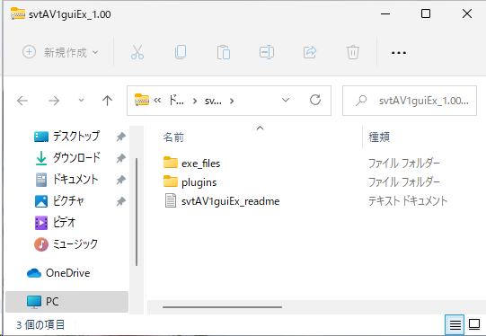
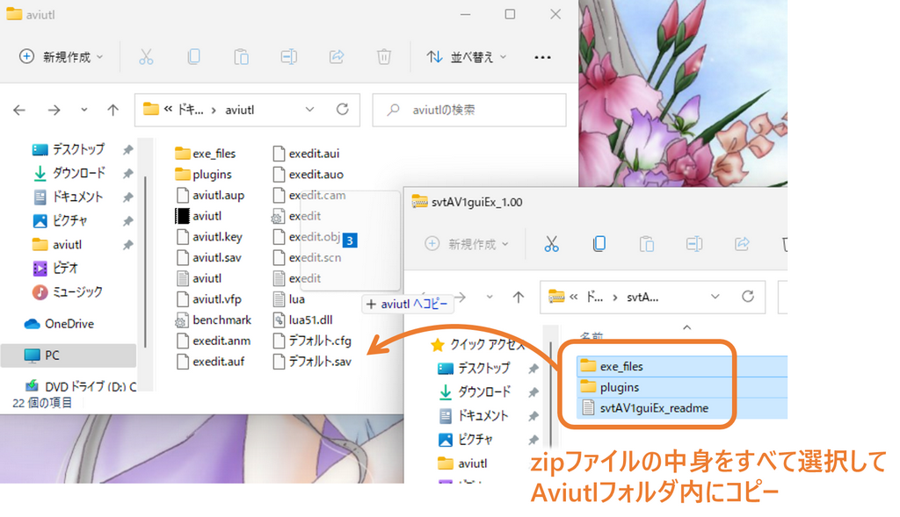
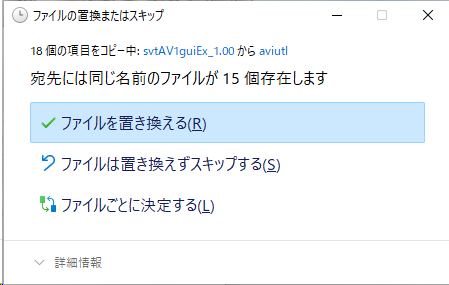
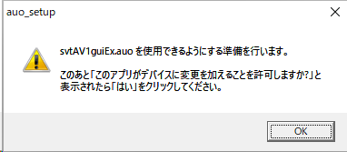
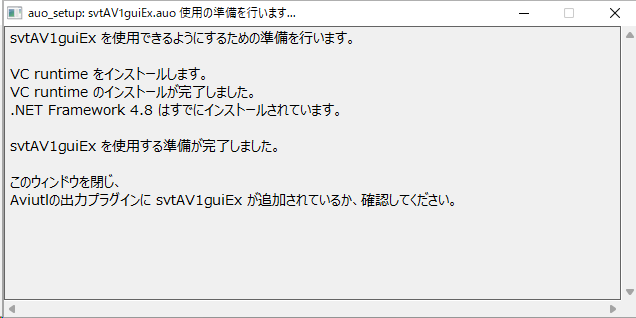
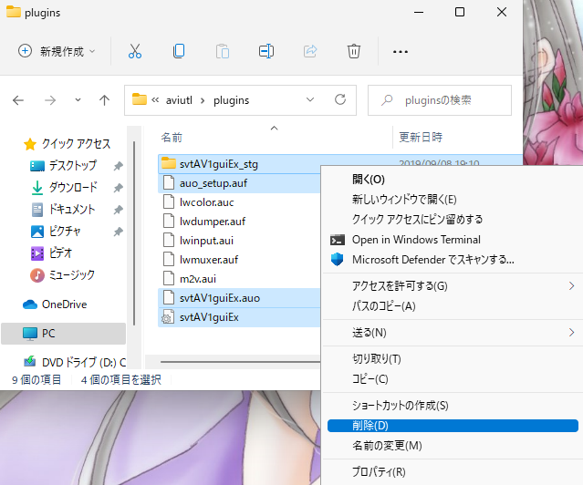

# 拡張 SVT-AV1 出力(GUI) Ex  
by rigaya  

拡張 SVT-AV1 出力(GUI) Ex (svtAV1guiEx) は、[SVT-AV1](https://gitlab.com/AOMediaCodec/SVT-AV1)を使用してエンコードを行うAviutlの出力プラグインです。

## ダウンロード & 更新履歴
[rigayaの日記兼メモ帳＞＞](http://rigaya34589.blog135.fc2.com/blog-category-28.html)

## 想定動作環境
Windows 10/11 (x64)  
Aviutl 1.00 以降 推奨

x86(32bit)環境では動作しません。

## svtAV1guiExの使用方法
同梱のSvtAv1EncApp.exeとともに、[mp4box](https://gpac.wp.imt.fr/downloads/)/[mkvmerge](https://mkvtoolnix.download/downloads.html#windows)、さらに追加で音声エンコーダが必要です。

## svtAV1guiEx 使用にあたっての注意事項
無保証です。自己責任で使用してください。  
拡張 SVT-AV1 出力(GUI) Exを使用したことによる、いかなる損害・トラブルについても責任を負いません。  

## svtAV1guiEx の Aviutl への導入・更新

### ダウンロード

まず、svtAV1guiExを[こちら](https://github.com/rigaya/svtAV1guiEx/releases)からダウンロードします。

### 導入・更新

ダウンロードしたzipファイルをダブルクリックして開きます。中身はこんな感じです。

中身をすべてAviutlフォルダにコピーします。

更新時には、下記のように上書きするか聞いてくることがあります。

その場合には「ファイルを置き換える」を選択して上書きしてください。

  
  
  
このあとAviutlをダブルクリックして起動してください。

初回起動時に必要に応じて下の図のようにsvtAV1guiExの使用準備をするというメッセージが出ます。環境によっては準備が不要な場合があり、その場合は表示されません。

OKをクリックすると使用準備が開始されます。

  
  
  
下の図のように、「この不明な発行元からのアプリがデバイスに変更を加えることを許可しますか?」というメッセージが表示されますので、「はい」をクリックしてください。

  
  
  
下の図のようなウィンドウが表示され、svtAV1guiExの使用に必要なモジュールがインストールされます。

エラーなくインストールが完了すると下記のように表示されますので、右上の[x]ボタンでウィンドウを閉じてください。

これで使用準備は完了です。

## iniファイルによる拡張
svtAV1guiEx.iniを書き換えることにより、音声エンコーダやmuxerのコマンドラインを変更できます。また音声エンコーダを追加することもできます。

デフォルトの設定では不十分だと思った場合は、iniファイルの音声やmuxerのコマンドラインを調整してみてください。

## svtAV1guiEx の Aviutl からの削除

svtAV1guiEx の Aviutl から削除するには、"plugins" フォルダ内の下記ファイルとフォルダを削除してください。

- [フォルダ] svtAV1guiEx_stg
- [ファイル] svtAV1guiEx.auo
- [ファイル] svtAV1guiEx(.ini)
- [ファイル] auo_setup.auf

## ソースコードについて
- MITライセンスです。

### ソースの構成
VCビルド  
文字コード: UTF-8-BOM  
改行: CRLF  
インデント: 空白x4  
